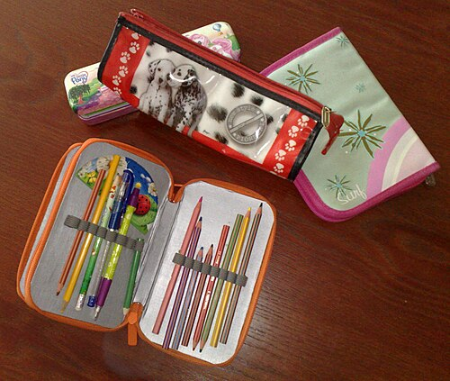
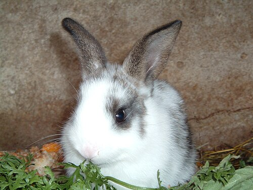

# 🟦 Term 1 — MCQ Mock Test 1

**25 multiple‑choice questions.** Write your letter (A/B/C/D) on paper first, then open the arrow to check.

> ▶ Click **"Answer & explanation"** under each question only **after** you've answered. It tells you what the
> question meant and gives the correct answer in **English and Spanish**.

---

**Q1.** What does **Estoy contento** mean?
- A) I am tired
- B) I am happy
- C) I am angry
- D) I am worried

▶ Answer & explanation

**The question means:** What does the Spanish sentence *Estoy contento* mean in English?
**✅ Correct: B) I am happy**
- 🇬🇧 *I am happy*
- 🇪🇸 **Estoy contento** (boy) / **Estoy contenta** (girl) — *estoy* is "I am" for feelings.

---

**Q2.** How do you say **I am tired** (if you are a girl)?
- A) Estoy cansado
- B) Estoy cansada
- C) Estoy enfadada
- D) Estoy contenta

▶ Answer & explanation

**The question means:** Choose the correct Spanish for "I am tired", spoken by a girl.
**✅ Correct: B) Estoy cansada**
- 🇬🇧 *I am tired*
- 🇪🇸 **Estoy cansada** — a girl uses the **‑a** ending. A boy would say *Estoy cansado*.

---

**Q3.** Which word means **but**?
- A) porque
- B) y
- C) pero
- D) también

▶ Answer & explanation

**The question means:** Which Spanish word means "but"?
**✅ Correct: C) pero**
- 🇬🇧 *but*
- 🇪🇸 **pero** — *Estoy bien pero cansado.* (I'm fine but tired.) *(porque = because, y = and)*

---

**Q4.** **¿Cómo te llamas?** is asking…
- A) How old are you?
- B) Where do you live?
- C) What is your name?
- D) How are you?

▶ Answer & explanation

**The question means:** What is the Spanish question *¿Cómo te llamas?* asking you?
**✅ Correct: C) What is your name?**
- 🇬🇧 *What are you called? / What is your name?*
- 🇪🇸 You answer: **Me llamo…** (My name is…)

---

**Q5.** How do you say **I am 12 years old**?
- A) Soy doce años
- B) Tengo doce años
- C) Tengo doce
- D) Estoy doce años

▶ Answer & explanation

**The question means:** Choose the correct way to say your age in Spanish.
**✅ Correct: B) Tengo doce años**
- 🇬🇧 *I am 12 years old*
- 🇪🇸 **Tengo doce años** — in Spanish you *have* years (tengo = I have). Never use *soy* or *estoy* for age.

---

**Q6.** Which number is **quince**?
- A) 5
- B) 14
- C) 15
- D) 50

▶ Answer & explanation

**The question means:** What number is the Spanish word *quince*?
**✅ Correct: C) 15**
- 🇬🇧 *fifteen*
- 🇪🇸 **quince = 15** *(cinco = 5, catorce = 14)*

---

**Q7.** Which is the Spanish for **Wednesday**?
- A) martes
- B) miércoles
- C) jueves
- D) viernes

▶ Answer & explanation

**The question means:** Which day of the week is "Wednesday" in Spanish?
**✅ Correct: B) miércoles**
- 🇬🇧 *Wednesday*
- 🇪🇸 **miércoles** *(martes = Tuesday, jueves = Thursday, viernes = Friday)*

---

**Q8.** **Mi cumpleaños es el cinco de mayo.** When is the birthday?
- A) 5th of March
- B) 5th of May
- C) 15th of May
- D) 9th of May

▶ Answer & explanation

**The question means:** Read the Spanish date and choose the correct one in English.
**✅ Correct: B) 5th of May**
- 🇬🇧 *My birthday is the 5th of May*
- 🇪🇸 **el cinco de mayo** — *cinco* = 5, *mayo* = May. (March = marzo.)

---

**Q9.** Look at the picture. What is it?
 
- A) la mochila
- B) el estuche
- C) la regla
- D) el libro

▶ Answer & explanation

**The question means:** Name this object in Spanish.
**✅ Correct: B) el estuche**
- 🇬🇧 *pencil case*
- 🇪🇸 **el estuche** — *Tengo un estuche azul.* (I have a blue pencil case.)

---

**Q10.** Which word means **a pen**?
- A) un lápiz
- B) una goma
- C) un bolígrafo
- D) una regla

▶ Answer & explanation

**The question means:** Which Spanish word means "a pen"?
**✅ Correct: C) un bolígrafo**
- 🇬🇧 *a pen*
- 🇪🇸 **un bolígrafo** (often shortened to *un boli*). *(un lápiz = a pencil, una goma = a rubber, una regla = a ruler)*

---

**Q11.** What does **una regla** mean?
- A) a rubber
- B) a ruler
- C) a folder
- D) a book

▶ Answer & explanation

**The question means:** Translate *una regla* into English.
**✅ Correct: B) a ruler**
- 🇬🇧 *a ruler*
- 🇪🇸 **una regla** *(una goma = a rubber, una carpeta = a folder, un libro = a book)*

---

**Q12.** Choose the correct word for **a** in: ___ **mochila** (mochila is feminine).
- A) un
- B) una
- C) el
- D) unos

▶ Answer & explanation

**The question means:** Pick the right word for "a" before the feminine noun *mochila*.
**✅ Correct: B) una**
- 🇬🇧 *a backpack*
- 🇪🇸 **una mochila** — feminine nouns take **una**; masculine take **un** (un libro).

---

**Q13.** What colour is **rojo**?
- A) green
- B) blue
- C) red
- D) yellow

▶ Answer & explanation

**The question means:** What colour does *rojo* mean?
**✅ Correct: C) red**
- 🇬🇧 *red*
- 🇪🇸 **rojo / roja** *(verde = green, azul = blue, amarillo = yellow)*

---

**Q14.** How do you say **a green book**? (*libro* is masculine)
- A) un libro verde
- B) una libra verde
- C) un verde libro
- D) un libro verda

▶ Answer & explanation

**The question means:** Choose the correct phrase for "a green book".
**✅ Correct: A) un libro verde**
- 🇬🇧 *a green book*
- 🇪🇸 **un libro verde** — the colour comes **after** the noun, and *verde* doesn't change for masculine/feminine.

---

**Q15.** Which sentence means **My backpack is new**?
- A) Mi mochila es vieja
- B) Mi mochila es nueva
- C) Mi mochila es fea
- D) Mi mochila es útil

▶ Answer & explanation

**The question means:** Pick the Spanish for "My backpack is new".
**✅ Correct: B) Mi mochila es nueva**
- 🇬🇧 *My backpack is new*
- 🇪🇸 **Mi mochila es nueva** — *mochila* is feminine, so *nuevo → nueva*. *(vieja = old, fea = ugly, útil = useful)*

---

**Q16.** What does **horroroso** mean?
- A) cool
- B) useful
- C) rubbish / horrible
- D) new

▶ Answer & explanation

**The question means:** Translate the adjective *horroroso*.
**✅ Correct: C) rubbish / horrible**
- 🇬🇧 *rubbish / horrible*
- 🇪🇸 **horroroso / horrorosa** *(chulo = cool, útil = useful, nuevo = new)*

---

**Q17.** Look at the picture. Which pet is this?
 
- A) un gato
- B) un perro
- C) un conejo
- D) una tortuga

▶ Answer & explanation

**The question means:** Name this animal in Spanish.
**✅ Correct: C) un conejo**
- 🇬🇧 *a rabbit*
- 🇪🇸 **un conejo** *(un gato = a cat, un perro = a dog, una tortuga = a tortoise)*

---

**Q18.** **Tengo un perro y dos gatos.** How many pets in total?
- A) 1
- B) 2
- C) 3
- D) 4

▶ Answer & explanation

**The question means:** Read the sentence and count the pets.
**✅ Correct: C) 3**
- 🇬🇧 *I have a dog and two cats* → 1 + 2 = 3 pets.
- 🇪🇸 **Tengo un perro y dos gatos.**

---

**Q19.** Which word means **sister**?
- A) el hermano
- B) la hermana
- C) la madre
- D) el padre

▶ Answer & explanation

**The question means:** Which Spanish word means "sister"?
**✅ Correct: B) la hermana**
- 🇬🇧 *sister*
- 🇪🇸 **la hermana** *(el hermano = brother, la madre = mother, el padre = father)*

---

**Q20.** **Tengo el pelo rubio.** What does this mean?
- A) I have brown hair
- B) I have blond hair
- C) I have blue eyes
- D) I have long hair

▶ Answer & explanation

**The question means:** Translate *Tengo el pelo rubio.*
**✅ Correct: B) I have blond hair**
- 🇬🇧 *I have blond hair*
- 🇪🇸 **Tengo el pelo rubio** — *pelo* = hair, *rubio* = blond. *(moreno = brown/dark, largo = long)*

---

**Q21.** How do you say **I have green eyes**?
- A) Tengo el pelo verde
- B) Tengo los ojos verdes
- C) Tengo los ojos azules
- D) Soy verde

▶ Answer & explanation

**The question means:** Choose the Spanish for "I have green eyes".
**✅ Correct: B) Tengo los ojos verdes**
- 🇬🇧 *I have green eyes*
- 🇪🇸 **Tengo los ojos verdes** — *ojos* = eyes; the colour is plural (*verdes*) because there are two eyes.

---

**Q22.** What does **Soy simpática** mean (girl speaking)?
- A) I am lazy
- B) I am shy
- C) I am nice / friendly
- D) I am sporty

▶ Answer & explanation

**The question means:** Translate the personality sentence *Soy simpática.*
**✅ Correct: C) I am nice / friendly**
- 🇬🇧 *I am nice / friendly*
- 🇪🇸 **Soy simpática** — note **soy** (not estoy) is used for personality. *(perezoso = lazy, tímido = shy, deportista = sporty)*

---

**Q23.** Which is the **odd one out** (not a feeling)?
- A) triste
- B) nervioso
- C) preocupado
- D) bolígrafo

▶ Answer & explanation

**The question means:** Three words are feelings; one is not. Find the one that isn't.
**✅ Correct: D) bolígrafo**
- 🇬🇧 *bolígrafo* = a **pen** (a school object), not a feeling.
- 🇪🇸 *triste = sad, nervioso = nervous, preocupado = worried* are all feelings.

---

**Q24.** Choose the correct verb: **___ contento porque es mi cumpleaños.**
- A) Soy
- B) Tengo
- C) Estoy
- D) Vivo

▶ Answer & explanation

**The question means:** Pick the right verb for "I am happy because it's my birthday." (a feeling)
**✅ Correct: C) Estoy**
- 🇬🇧 *I am happy because it's my birthday*
- 🇪🇸 **Estoy contento porque es mi cumpleaños** — feelings use **estoy**, not *soy*.

---

**Q25.** **Mi gato es negro y blanco.** What colours is the cat?
- A) brown and white
- B) black and grey
- C) black and white
- D) grey and white

▶ Answer & explanation

**The question means:** Read the sentence and choose the cat's colours.
**✅ Correct: C) black and white**
- 🇬🇧 *My cat is black and white*
- 🇪🇸 **negro** = black, **blanco** = white. *(marrón = brown, gris = grey)*

---

### 🏁 Your score: ____ / 25
- **22–25:** ¡Excelente! 🌟  ·  **17–21:** ¡Muy bien!  ·  **Under 17:** re‑read the [Term 1 guide](../../study-guides/term-1-guide.md) and try again.

➡️ Next: [Term 1 — MCQ Mock 2](mcq-mock-2.md)
