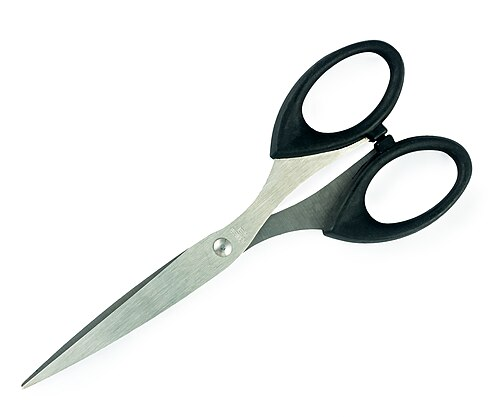
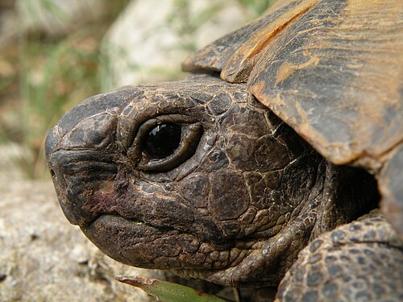

# 🟦 Term 1 — MCQ Mock Test 2

**25 multiple‑choice questions.** Answer first, then open the arrow to check.

---

**Q1.** What does **Estoy fatal** mean?
- A) I am great
- B) I am terrible
- C) I am calm
- D) I am excited

▶ Answer & explanation

**The question means:** Translate *Estoy fatal.*
**✅ Correct: B) I am terrible**
- 🇬🇧 *I am terrible / awful*
- 🇪🇸 **Estoy fatal** *(fenomenal = great, tranquilo = calm, emocionado = excited)*

---

**Q2.** Which means **I am excited** (boy)?
- A) Estoy emocionado
- B) Estoy enfadado
- C) Estoy enfermo
- D) Estoy celoso

▶ Answer & explanation

**The question means:** Choose the Spanish for "I am excited" said by a boy.
**✅ Correct: A) Estoy emocionado**
- 🇬🇧 *I am excited*
- 🇪🇸 **Estoy emocionado** *(enfadado = angry, enfermo = ill, celoso = jealous)*

---

**Q3.** **¿Dónde vives?** is asking…
- A) How old are you?
- B) Where do you live?
- C) How are you?
- D) When is your birthday?

▶ Answer & explanation

**The question means:** What is *¿Dónde vives?* asking?
**✅ Correct: B) Where do you live?**
- 🇬🇧 *Where do you live?*
- 🇪🇸 You answer **Vivo en…** (I live in…)

---

**Q4.** How do you say **My name is Ana**?
- A) Tengo Ana
- B) Soy Ana años
- C) Me llamo Ana
- D) Vivo Ana

▶ Answer & explanation

**The question means:** Pick the correct Spanish for "My name is Ana".
**✅ Correct: C) Me llamo Ana**
- 🇬🇧 *My name is Ana / I am called Ana*
- 🇪🇸 **Me llamo Ana**

---

**Q5.** Which number is **veintitrés**?
- A) 13
- B) 23
- C) 33
- D) 20

▶ Answer & explanation

**The question means:** What number is *veintitrés*?
**✅ Correct: B) 23**
- 🇬🇧 *twenty‑three*
- 🇪🇸 **veintitrés = 20 + 3 = 23** *(trece = 13)*

---

**Q6.** Which is **August** in Spanish?
- A) abril
- B) agosto
- C) octubre
- D) enero

▶ Answer & explanation

**The question means:** Which month is "August"?
**✅ Correct: B) agosto**
- 🇬🇧 *August*
- 🇪🇸 **agosto** *(abril = April, octubre = October, enero = January)*

---

**Q7.** **el treinta y uno de diciembre** is…
- A) 30th of December
- B) 31st of December
- C) 13th of December
- D) 31st of November

▶ Answer & explanation

**The question means:** Read the date and choose its English meaning.
**✅ Correct: B) 31st of December**
- 🇬🇧 *the 31st of December*
- 🇪🇸 **treinta y uno** = 31, **diciembre** = December.

---

**Q8.** Look at the picture. What is it?
 
- A) el pegamento
- B) las tijeras
- C) la goma
- D) el sacapuntas

▶ Answer & explanation

**The question means:** Name this object in Spanish.
**✅ Correct: B) las tijeras**
- 🇬🇧 *scissors*
- 🇪🇸 **las tijeras** (always plural, like in English). *(pegamento = glue, goma = rubber, sacapuntas = sharpener)*

---

**Q9.** What does **un cuaderno** mean?
- A) a dictionary
- B) an exercise book
- C) a calculator
- D) a folder

▶ Answer & explanation

**The question means:** Translate *un cuaderno.*
**✅ Correct: B) an exercise book**
- 🇬🇧 *an exercise book / notebook*
- 🇪🇸 **un cuaderno** *(diccionario = dictionary, calculadora = calculator, carpeta = folder)*

---

**Q10.** Which word means **glue**?
- A) el pegamento
- B) el rotulador
- C) la agenda
- D) el sacapuntas

▶ Answer & explanation

**The question means:** Which Spanish word means "glue"?
**✅ Correct: A) el pegamento**
- 🇬🇧 *glue / glue stick*
- 🇪🇸 **el pegamento** *(rotulador = marker, agenda = planner, sacapuntas = sharpener)*

---

**Q11.** **No tengo una regla.** What does it mean?
- A) I have a ruler
- B) I want a ruler
- C) I don't have a ruler
- D) There is a ruler

▶ Answer & explanation

**The question means:** Translate the negative sentence *No tengo una regla.*
**✅ Correct: C) I don't have a ruler**
- 🇬🇧 *I don't have a ruler*
- 🇪🇸 **No tengo una regla** — *no* before the verb makes it negative.

---

**Q12.** Which colour is **morado**?
- A) pink
- B) purple
- C) grey
- D) orange

▶ Answer & explanation

**The question means:** What colour is *morado*?
**✅ Correct: B) purple**
- 🇬🇧 *purple*
- 🇪🇸 **morado** *(rosa = pink, gris = grey, naranja = orange)*

---

**Q13.** How do you say **a red rubber**? (*goma* is feminine)
- A) una goma rojo
- B) un goma roja
- C) una goma roja
- D) una roja goma

▶ Answer & explanation

**The question means:** Choose the correct phrase for "a red rubber".
**✅ Correct: C) una goma roja**
- 🇬🇧 *a red rubber/eraser*
- 🇪🇸 **una goma roja** — feminine noun → *roja* (with ‑a), and the colour goes **after** the noun.

---

**Q14.** Which sentence means **They are useful**?
- A) Es útil
- B) Son útiles
- C) Es feo
- D) Son nuevos

▶ Answer & explanation

**The question means:** Pick the Spanish for "They are useful".
**✅ Correct: B) Son útiles**
- 🇬🇧 *They are useful*
- 🇪🇸 **Son útiles** — *son* = they are; *útiles* is the plural of *útil*.

---

**Q15.** Look at the picture. Which pet is this?
 
- A) una serpiente
- B) una tortuga
- C) un pez
- D) una araña

▶ Answer & explanation

**The question means:** Name this animal in Spanish.
**✅ Correct: B) una tortuga**
- 🇬🇧 *a tortoise*
- 🇪🇸 **una tortuga** *(serpiente = snake, pez = fish, araña = spider)*

---

**Q16.** What does **Se llama Max** mean (about a pet)?
- A) I have Max
- B) It is called Max
- C) Max is big
- D) I want Max

▶ Answer & explanation

**The question means:** Translate *Se llama Max.*
**✅ Correct: B) It is called Max**
- 🇬🇧 *It/he is called Max*
- 🇪🇸 **Se llama Max** — used to give a pet's (or person's) name.

---

**Q17.** Which word means **grandmother**?
- A) la abuela
- B) el abuelo
- C) la tía
- D) la prima

▶ Answer & explanation

**The question means:** Which word means "grandmother"?
**✅ Correct: A) la abuela**
- 🇬🇧 *grandmother*
- 🇪🇸 **la abuela** *(abuelo = grandfather, tía = aunt, prima = female cousin)*

---

**Q18.** **En mi familia hay cinco personas.** How many people?
- A) 4
- B) 5
- C) 6
- D) 15

▶ Answer & explanation

**The question means:** Read the sentence and say how many people are in the family.
**✅ Correct: B) 5**
- 🇬🇧 *In my family there are five people*
- 🇪🇸 **cinco = 5.** *(hay = there is/are)*

---

**Q19.** **Soy hija única** means…
- A) I have one sister
- B) I am an only child (girl)
- C) I am the oldest
- D) I have a big family

▶ Answer & explanation

**The question means:** Translate *Soy hija única.*
**✅ Correct: B) I am an only child (girl)**
- 🇬🇧 *I am an only child* (a boy says **hijo único**)
- 🇪🇸 **Soy hija única**

---

**Q20.** How do you say **I have short curly hair**?
- A) Tengo el pelo largo y liso
- B) Tengo el pelo corto y rizado
- C) Tengo los ojos marrones
- D) Tengo el pelo rubio y largo

▶ Answer & explanation

**The question means:** Choose the Spanish for "I have short, curly hair".
**✅ Correct: B) Tengo el pelo corto y rizado**
- 🇬🇧 *I have short curly hair*
- 🇪🇸 **corto** = short, **rizado** = curly. *(largo = long, liso = straight)*

---

**Q21.** **Llevo gafas** means…
- A) I have a beard
- B) I wear glasses
- C) I have freckles
- D) I am tall

▶ Answer & explanation

**The question means:** Translate *Llevo gafas.*
**✅ Correct: B) I wear glasses**
- 🇬🇧 *I wear glasses*
- 🇪🇸 **Llevo gafas** *(barba = beard, pecas = freckles, alto = tall)*

---

**Q22.** Which word means **lazy**?
- A) trabajador
- B) perezoso
- C) divertido
- D) inteligente

▶ Answer & explanation

**The question means:** Which personality word means "lazy"?
**✅ Correct: B) perezoso**
- 🇬🇧 *lazy*
- 🇪🇸 **perezoso / perezosa** *(trabajador = hardworking, divertido = fun, inteligente = clever)*

---

**Q23.** Choose the correct verb: **Mi hermana ___ muy habladora.**
- A) tengo
- B) estoy
- C) es
- D) vivo

▶ Answer & explanation

**The question means:** Pick the right verb for "My sister is very talkative." (a personality trait, 3rd person)
**✅ Correct: C) es**
- 🇬🇧 *My sister is very talkative*
- 🇪🇸 **Mi hermana es muy habladora** — personality uses *ser*; *es* = he/she is.

---

**Q24.** Which is the **odd one out** (not a school object)?
- A) el lápiz
- B) la mochila
- C) el gato
- D) la calculadora

▶ Answer & explanation

**The question means:** Three are school objects, one is not.
**✅ Correct: C) el gato**
- 🇬🇧 *el gato* = a **cat** (a pet), not a school object.
- 🇪🇸 *lápiz = pencil, mochila = backpack, calculadora = calculator.*

---

**Q25.** **Tengo dos perros marrones.** What is correct?
- A) one brown dog
- B) two brown dogs
- C) two black dogs
- D) two brown cats

▶ Answer & explanation

**The question means:** Translate *Tengo dos perros marrones.*
**✅ Correct: B) two brown dogs**
- 🇬🇧 *I have two brown dogs*
- 🇪🇸 **dos perros marrones** — *perros* is plural, so *marrón → marrones*.

---

### 🏁 Your score: ____ / 25
- **22–25:** ¡Excelente! 🌟  ·  **17–21:** ¡Muy bien!  ·  **Under 17:** review the [Term 1 guide](../../study-guides/term-1-guide.md).

➡️ Next: [Term 1 — Q&A Mock 1](qa-mock-1.md)
