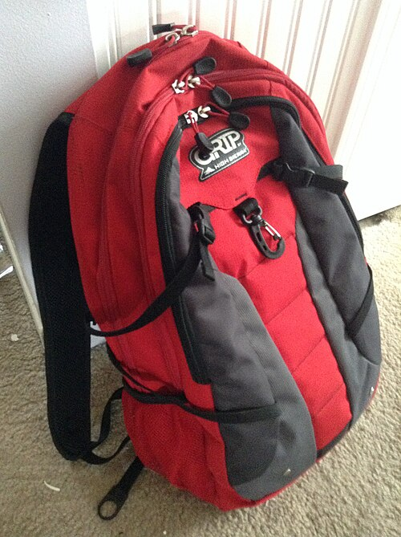

# 🟦 Term 1 — Question & Answer Mock Test 1

**15 written questions.** Write a **full sentence** answer on paper, then open the arrow to check. There can be more than one correct way to say something — the model answer shows a good one.

---

**Q1.** Answer in Spanish: **¿Cómo te llamas?** *(say your name is Lucía)*

▶ Answer & explanation

**The question means:** "What is your name?" — write a sentence saying your name is Lucía.
**✅ Model answer:**
- 🇪🇸 **Me llamo Lucía.**
- 🇬🇧 *My name is Lucía.*

---

**Q2.** Answer in Spanish: **¿Cuántos años tienes?** *(say you are 12)*

▶ Answer & explanation

**The question means:** "How old are you?" — say that you are 12.
**✅ Model answer:**
- 🇪🇸 **Tengo doce años.**
- 🇬🇧 *I am 12 years old.* (Remember: in Spanish you *have* years — **tengo**.)

---

**Q3.** Translate into Spanish: **I am happy because it is my birthday.** *(boy)*

▶ Answer & explanation

**The question means:** Put the whole English sentence into Spanish.
**✅ Model answer:**
- 🇪🇸 **Estoy contento porque es mi cumpleaños.**
- 🇬🇧 *I am happy because it is my birthday.* (Feelings use **estoy**; *porque* = because.)

---

**Q4.** Translate into English: **Estoy un poco cansada pero contenta.**

▶ Answer & explanation

**The question means:** Put the Spanish sentence into English.
**✅ Model answer:**
- 🇬🇧 *I am a little tired but happy.*
- 🇪🇸 **Estoy un poco cansada pero contenta** — *un poco* = a little, *pero* = but. (The **‑a** endings tell us a girl is speaking.)

---

**Q5.** Answer in Spanish: **¿Cuándo es tu cumpleaños?** *(say it is the 15th of June)*

▶ Answer & explanation

**The question means:** "When is your birthday?" — say the 15th of June.
**✅ Model answer:**
- 🇪🇸 **Mi cumpleaños es el quince de junio.**
- 🇬🇧 *My birthday is the 15th of June.* (Pattern: **el** + number + **de** + month.)

---

**Q6.** Write in Spanish the date: **Monday, the 2nd of May.**

▶ Answer & explanation

**The question means:** Write the full date in Spanish.
**✅ Model answer:**
- 🇪🇸 **lunes, el dos de mayo** (or *Hoy es lunes, dos de mayo.*)
- 🇬🇧 *Monday, the 2nd of May.* (Days and months have **no capital letters** in Spanish.)

---

**Q7.** Translate into Spanish: **In my bag I have a pen, a pencil and a ruler.**

▶ Answer & explanation

**The question means:** Put the sentence into Spanish.
**✅ Model answer:**
- 🇪🇸 **En mi mochila tengo un bolígrafo, un lápiz y una regla.**
- 🇬🇧 *In my bag I have a pen, a pencil and a ruler.* (un/un/**una** — *regla* is feminine.)

---

**Q8.** Translate into English: **No tengo estuche, pero tengo un cuaderno.**

▶ Answer & explanation

**The question means:** Put the Spanish into English.
**✅ Model answer:**
- 🇬🇧 *I don't have a pencil case, but I have an exercise book.*
- 🇪🇸 **No tengo estuche, pero tengo un cuaderno** — *no… pero…* = don't… but…

---

**Q9.** Look at the picture and write what it is, in Spanish, with **un** or **una**.
 

▶ Answer & explanation

**The question means:** Name the object using "a" + the word.
**✅ Model answer:**
- 🇪🇸 **una mochila**
- 🇬🇧 *a backpack* (*mochila* is feminine → **una**.)

---

**Q10.** Translate into Spanish: **My backpack is new and cool.**

▶ Answer & explanation

**The question means:** Put the sentence into Spanish (watch the adjective endings!).
**✅ Model answer:**
- 🇪🇸 **Mi mochila es nueva y chula.**
- 🇬🇧 *My backpack is new and cool.* (*mochila* is feminine → *nuevo→nueva*, *chulo→chula*.)

---

**Q11.** Translate into Spanish: **I have a black and white cat.**

▶ Answer & explanation

**The question means:** Put the sentence into Spanish.
**✅ Model answer:**
- 🇪🇸 **Tengo un gato negro y blanco.**
- 🇬🇧 *I have a black and white cat.* (Colours come **after** the noun.)

---

**Q12.** Answer in Spanish: **¿Tienes mascotas?** *(say you have two dogs)*

▶ Answer & explanation

**The question means:** "Do you have pets?" — say you have two dogs.
**✅ Model answer:**
- 🇪🇸 **Sí, tengo dos perros.**
- 🇬🇧 *Yes, I have two dogs.* (*perro → perros* for plural.)

---

**Q13.** Translate into Spanish: **I have long blond hair and blue eyes.** *(girl)*

▶ Answer & explanation

**The question means:** Put the description into Spanish.
**✅ Model answer:**
- 🇪🇸 **Tengo el pelo rubio y largo y los ojos azules.**
- 🇬🇧 *I have long blond hair and blue eyes.* (*ojos azules* — plural because two eyes.)

---

**Q14.** Translate into English: **Mi hermano es alto, gracioso y un poco perezoso.**

▶ Answer & explanation

**The question means:** Put the Spanish into English.
**✅ Model answer:**
- 🇬🇧 *My brother is tall, funny and a little lazy.*
- 🇪🇸 **alto = tall, gracioso = funny, perezoso = lazy.**

---

**Q15.** Write 2–3 sentences in Spanish describing yourself: your name, your age and how you feel today.

▶ Answer & explanation

**The question means:** Write a short self‑introduction using Term 1 language.
**✅ Model answer:**
- 🇪🇸 **Me llamo Sara. Tengo doce años. Hoy estoy muy contenta porque es viernes.**
- 🇬🇧 *My name is Sara. I am 12 years old. Today I am very happy because it's Friday.*
- ✔️ Good answers use **Me llamo… / Tengo … años / Estoy …**. Change the words to fit you!

---

### 🏁 How did you do? Tick each one you got right: ____ / 15
➡️ Next: [Term 1 — Q&A Mock 2](qa-mock-2.md)
