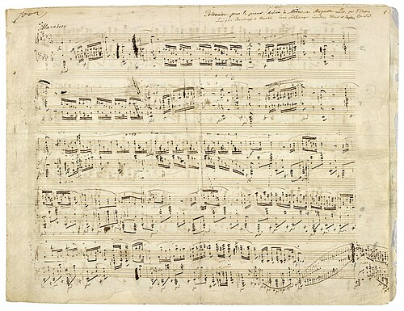

# 🟥 Term 3 — MCQ Mock Test 1

**25 multiple‑choice questions** on *school subjects & opinions, teachers, what's in your school, the timetable and telling the time.* Answer first, then open the arrow.

---

**Q1.** What does **las matemáticas** mean?
- A) science
- B) maths
- C) music
- D) history

▶ Answer & explanation

**The question means:** Translate *las matemáticas.*
**✅ Correct: B) maths**
- 🇬🇧 *maths*
- 🇪🇸 **las matemáticas** (plural). *(las ciencias = science, la música = music, la historia = history)*

---

**Q2.** Which subject is **la geografía**?
- A) history
- B) geography
- C) biology
- D) chemistry

▶ Answer & explanation

**The question means:** Translate *la geografía.*
**✅ Correct: B) geography**
- 🇬🇧 *geography*
- 🇪🇸 **la geografía** *(la historia = history, la biología = biology, la química = chemistry)*

---

**Q3.** Look at the picture. What subject is this?
 
- A) el arte
- B) la música
- C) el teatro
- D) la tecnología

▶ Answer & explanation

**The question means:** Name the school subject in Spanish.
**✅ Correct: B) la música**
- 🇬🇧 *music*
- 🇪🇸 **la música** *(el arte = art, el teatro = drama, la tecnología = technology)*

---

**Q4.** **Me gusta el inglés** means…
- A) I hate English
- B) I like English
- C) I love English
- D) I prefer English

▶ Answer & explanation

**The question means:** Translate *Me gusta el inglés.*
**✅ Correct: B) I like English**
- 🇬🇧 *I like English*
- 🇪🇸 **Me gusta** = I like. *(Odio = I hate, Me encanta = I love, Prefiero = I prefer)*

---

**Q5.** Which means **I love**…?
- A) No me gusta
- B) Odio
- C) Me encanta
- D) Prefiero

▶ Answer & explanation

**The question means:** Which phrase means "I love"?
**✅ Correct: C) Me encanta**
- 🇬🇧 *I love*
- 🇪🇸 **Me encanta** *(No me gusta = I don't like, Odio = I hate, Prefiero = I prefer)*

---

**Q6.** **Odio las ciencias** means…
- A) I like science
- B) I love science
- C) I hate science
- D) I study science

▶ Answer & explanation

**The question means:** Translate *Odio las ciencias.*
**✅ Correct: C) I hate science**
- 🇬🇧 *I hate science*
- 🇪🇸 **Odio** = I hate.

---

**Q7.** Which adjective means **boring**?
- A) divertido
- B) aburrido
- C) interesante
- D) fácil

▶ Answer & explanation

**The question means:** Which word means "boring"?
**✅ Correct: B) aburrido**
- 🇬🇧 *boring*
- 🇪🇸 **aburrido/a** *(divertido = fun, interesante = interesting, fácil = easy)*

---

**Q8.** **Me gusta la historia porque es interesante.** Why does she like history?
- A) because it's easy
- B) because it's interesting
- C) because it's useful
- D) because it's fun

▶ Answer & explanation

**The question means:** Read the sentence and pick the reason.
**✅ Correct: B) because it's interesting**
- 🇬🇧 *I like history because it's interesting*
- 🇪🇸 **porque es interesante** = because it's interesting.

---

**Q9.** Which is correct: **Me ___ las matemáticas** (matemáticas is plural)?
- A) gusta
- B) gustan
- C) encanto
- D) gusto

▶ Answer & explanation

**The question means:** Choose *gusta* or *gustan* for a **plural** subject.
**✅ Correct: B) gustan**
- 🇬🇧 *I like maths*
- 🇪🇸 **Me gustan las matemáticas** — plural subject → **gustan**. (One subject → *gusta*: *Me gusta el arte*.)

---

**Q10.** Look at the picture. What subject is this?
 
- A) la educación física
- B) la informática
- C) la religión
- D) el arte

▶ Answer & explanation

**The question means:** Name the school subject in Spanish.
**✅ Correct: A) la educación física**
- 🇬🇧 *P.E. (physical education)*
- 🇪🇸 **la educación física** *(informática = ICT, religión = RE, arte = art)*

---

**Q11.** What does **Mi asignatura favorita es el arte** mean?
- A) My favourite subject is art
- B) My favourite teacher is art
- C) I don't like art
- D) Art is difficult

▶ Answer & explanation

**The question means:** Translate the sentence.
**✅ Correct: A) My favourite subject is art**
- 🇬🇧 *My favourite subject is art*
- 🇪🇸 **asignatura favorita** = favourite subject.

---

**Q12.** Which means **My maths teacher is strict**?
- A) Mi profesor de matemáticas es simpático
- B) Mi profesor de matemáticas es estricto
- C) Mi profesora de inglés es estricta
- D) Mi profesor de matemáticas es divertido

▶ Answer & explanation

**The question means:** Choose the sentence meaning "My maths teacher is strict".
**✅ Correct: B) Mi profesor de matemáticas es estricto**
- 🇬🇧 *My maths teacher is strict*
- 🇪🇸 **estricto** = strict. *(simpático = nice, divertido = fun)*

---

**Q13.** **Mi profesora de música es muy paciente.** What does *paciente* mean?
- A) strict
- B) patient
- C) funny
- D) boring

▶ Answer & explanation

**The question means:** Translate the adjective *paciente.*
**✅ Correct: B) patient**
- 🇬🇧 *patient*
- 🇪🇸 **paciente** = patient.

---

**Q14.** **En mi instituto hay una biblioteca** means…
- A) In my school there is a library
- B) In my school there is a gym
- C) My school has no library
- D) I like the library

▶ Answer & explanation

**The question means:** Translate the sentence.
**✅ Correct: A) In my school there is a library**
- 🇬🇧 *In my school there is a library*
- 🇪🇸 **hay** = there is/are; **biblioteca** = library.

---

**Q15.** Look at the picture. What is this place?
 
- A) la biblioteca
- B) el comedor
- C) el gimnasio
- D) el patio

▶ Answer & explanation

**The question means:** Name this place in a school, in Spanish.
**✅ Correct: B) el comedor**
- 🇬🇧 *the canteen / dining hall*
- 🇪🇸 **el comedor** *(biblioteca = library, gimnasio = gym, patio = playground)*

---

**Q16.** Which means **There isn't a swimming pool**?
- A) Hay una piscina
- B) No hay piscina
- C) Hay un gimnasio
- D) No hay biblioteca

▶ Answer & explanation

**The question means:** Choose "There isn't a swimming pool".
**✅ Correct: B) No hay piscina**
- 🇬🇧 *There isn't a swimming pool*
- 🇪🇸 **No hay** = there isn't/aren't; **piscina** = swimming pool.

---

**Q17.** **¿Qué hora es?** is asking…
- A) What day is it?
- B) What time is it?
- C) What subject is it?
- D) What is your name?

▶ Answer & explanation

**The question means:** What is *¿Qué hora es?* asking?
**✅ Correct: B) What time is it?**
- 🇬🇧 *What time is it?*
- 🇪🇸 You answer **Es la una** or **Son las…**

---

**Q18.** How do you say **It's one o'clock**?
- A) Son las una
- B) Es la una
- C) Son la una
- D) Es las una

▶ Answer & explanation

**The question means:** Choose the correct way to say "It's 1 o'clock".
**✅ Correct: B) Es la una**
- 🇬🇧 *It's one o'clock*
- 🇪🇸 **Es la una** — only 1 o'clock uses *Es la*; all other hours use *Son las*.

---

**Q19.** What time is **Son las tres y media**?
- A) 3:15
- B) 3:30
- C) 2:30
- D) 3:45

▶ Answer & explanation

**The question means:** Read the time and pick the clock time.
**✅ Correct: B) 3:30**
- 🇬🇧 *It's half past three*
- 🇪🇸 **y media** = half past. *(y cuarto = quarter past, menos cuarto = quarter to)*

---

**Q20.** How do you say **quarter to five**?
- A) Son las cinco y cuarto
- B) Son las cinco menos cuarto
- C) Son las cuatro y media
- D) Son las cinco en punto

▶ Answer & explanation

**The question means:** Choose "quarter to five".
**✅ Correct: B) Son las cinco menos cuarto**
- 🇬🇧 *It's quarter to five*
- 🇪🇸 **menos cuarto** = quarter to.

---

**Q21.** **Los lunes tengo historia a primera hora.** What does it mean?
- A) On Mondays I have history first lesson
- B) On Tuesdays I have history
- C) I like history
- D) History is at three o'clock

▶ Answer & explanation

**The question means:** Translate the timetable sentence.
**✅ Correct: A) On Mondays I have history first lesson**
- 🇬🇧 *On Mondays I have history first lesson*
- 🇪🇸 **Los lunes** = on Mondays, **a primera hora** = first lesson.

---

**Q22.** **¿Cuál es tu asignatura favorita?** is asking…
- A) What is your favourite day?
- B) What is your favourite subject?
- C) What time is your lesson?
- D) Who is your teacher?

▶ Answer & explanation

**The question means:** What is this question asking?
**✅ Correct: B) What is your favourite subject?**
- 🇬🇧 *What is your favourite subject?*
- 🇪🇸 **asignatura** = subject; **favorita** = favourite.

---

**Q23.** Which is the **odd one out** (not a school subject)?
- A) la química
- B) el comedor
- C) la geografía
- D) el teatro

▶ Answer & explanation

**The question means:** Three are subjects; one is not.
**✅ Correct: B) el comedor**
- 🇬🇧 *el comedor* = the **canteen** (a place), not a subject.
- 🇪🇸 *química = chemistry, geografía = geography, teatro = drama.*

---

**Q24.** Choose the correct verb: **Me ___ el arte porque es divertido.**
- A) gustan
- B) gusta
- C) encanta**n**
- D) odio

▶ Answer & explanation

**The question means:** Fill the gap in "I like art because it's fun" (art = one subject).
**✅ Correct: B) gusta**
- 🇬🇧 *I like art because it's fun*
- 🇪🇸 **Me gusta el arte** — one subject → **gusta**.

---

**Q25.** **Prefiero la informática porque es útil.** What is true?
- A) She hates ICT
- B) She prefers ICT because it's useful
- C) She prefers ICT because it's boring
- D) She likes art

▶ Answer & explanation

**The question means:** Read and choose the true statement.
**✅ Correct: B) She prefers ICT because it's useful**
- 🇬🇧 *I prefer ICT because it's useful*
- 🇪🇸 **Prefiero** = I prefer, **la informática** = ICT, **útil** = useful.

---

### 🏁 Your score: ____ / 25
- **22–25:** ¡Excelente! 🌟  ·  **17–21:** ¡Muy bien!  ·  **Under 17:** re‑read the [Term 3 guide](../../study-guides/term-3-guide.md).

➡️ Next: [Term 3 — MCQ Mock 2](mcq-mock-2.md)
