# 🇪🇸 Term 1 — Study Guide

**Topics:** feelings • personal information • birthdays, dates & numbers • school things in your bag • colours • describing your things • family • physical description • personality • pets

> 💡 **How to use this guide:** cover the English column with your hand, look at the Spanish word (and the picture), and say what it means. Then swap — look at the English and say the Spanish. The pictures are there to help the word "stick" in your memory. 🧠

---

## 1.1 ¿Cómo estás? — How are you (feeling)?

We use the verb **estar** for feelings: **estoy** = *I am*, **no estoy** = *I am not*.

> 🔑 **Sentence pattern:** *Estoy + feeling*, and you can add a reason with **porque** (because) or contrast with **pero** (but).
> Example: **Estoy contento porque es mi cumpleaños.** = *I'm happy because it's my birthday.*

### How well you feel
| Spanish | Say it like | English |
|---|---|---|
| (Estoy) **fenomenal** | feh‑noh‑meh‑NAL | great / fantastic |
| (Estoy) **muy bien** | mwee bee‑EN | very well |
| (Estoy) **bien** | bee‑EN | well / fine |
| (Estoy) **regular** | reh‑goo‑LAR | so‑so / OK |
| (Estoy) **mal** | mal | bad |
| (Estoy) **muy mal** | mwee mal | very bad |
| (Estoy) **fatal** | fah‑TAL | terrible |

### Emotions (these change ending: **‑o** for boys, **‑a** for girls)
| Spanish | Say it like | English |
|---|---|---|
| **contento/a** | kon‑TEN‑toh | happy |
| **triste** | TREES‑teh | sad |
| **cansado/a** | kan‑SAH‑doh | tired |
| **enfadado/a** | en‑fah‑DAH‑doh | angry |
| **tranquilo/a** | tran‑KEE‑loh | calm / relaxed |
| **feliz** | feh‑LEES | happy |
| **preocupado/a** | preh‑oh‑koo‑PAH‑doh | worried |
| **enfermo/a** | en‑FER‑moh | ill / sick |
| **nervioso/a** | ner‑bee‑OH‑soh | nervous |
| **estresado/a** | es‑treh‑SAH‑doh | stressed |
| **emocionado/a** | eh‑moh‑see‑oh‑NAH‑doh | excited |
| **celoso/a** | theh‑LOH‑soh | jealous |

🧠 **Remember:** *triste* sounds like "**triste**" → think of a **tris‑te** little tear. *Cansado* → you "**can't**" go on, you're tired.

---

## 1.2 La ficha — Personal information

| Question (someone asks you) | Your answer |
|---|---|
| **¿Cómo te llamas?** *(What are you called?)* | **Me llamo Ana.** *(My name is Ana.)* |
| **¿Cuántos años tienes?** *(How old are you?)* | **Tengo doce años.** *(I am 12 years old.)* |
| **¿Dónde vives?** *(Where do you live?)* | **Vivo en Londres.** *(I live in London.)* |
| **¿Cuándo es tu cumpleaños?** *(When is your birthday?)* | **Mi cumpleaños es el 5 de mayo.** |

> ⚠️ **Watch out!** In Spanish you **have** years, you are not "X years". *Tengo 12 años* = literally "I **have** 12 years".

---

## 1.3 Mi cumpleaños — Birthday, numbers, days & months

### Numbers 1–31 (you need these for dates!)
| # | Spanish | # | Spanish | # | Spanish |
|---|---|---|---|---|---|
| 1 | uno / primero | 11 | once | 21 | veintiuno |
| 2 | dos | 12 | doce | 22 | veintidós |
| 3 | tres | 13 | trece | 23 | veintitrés |
| 4 | cuatro | 14 | catorce | 24 | veinticuatro |
| 5 | cinco | 15 | quince | 25 | veinticinco |
| 6 | seis | 16 | dieciséis | 26 | veintiséis |
| 7 | siete | 17 | diecisiete | 27 | veintisiete |
| 8 | ocho | 18 | dieciocho | 28 | veintiocho |
| 9 | nueve | 19 | diecinueve | 29 | veintinueve |
| 10 | diez | 20 | veinte | 30 / 31 | treinta / treinta y uno |

### Days of the week — *los días* (Spanish does **not** use capital letters!)
**lunes** (Mon) · **martes** (Tue) · **miércoles** (Wed) · **jueves** (Thu) · **viernes** (Fri) · **sábado** (Sat) · **domingo** (Sun)

### Months — *los meses* (also **no capital letters**)
**enero** (Jan) · **febrero** (Feb) · **marzo** (Mar) · **abril** (Apr) · **mayo** (May) · **junio** (Jun) · **julio** (Jul) · **agosto** (Aug) · **septiembre** (Sep) · **octubre** (Oct) · **noviembre** (Nov) · **diciembre** (Dec)

> 🔑 **Saying a date:** **el** + number + **de** + month. Example: **el quince de junio** = *the 15th of June*.
> **Hoy es lunes, dos de mayo.** = *Today is Monday, the 2nd of May.*

---

## 1.4 En mi mochila — In my schoolbag

> 🔑 **Sentence patterns:** **Tengo** (I have) · **No tengo** (I don't have) · **Hay** (there is/are) · **Quiero** (I want).
> Use **un** before boy‑words (masculine) and **una** before girl‑words (feminine).

<table>
<tr>
<td align="center"> <b>la mochila</b> <i>moh‑CHEE‑lah</i> backpack</td>
<td align="center"> <b>el estuche</b> <i>es‑TOO‑cheh</i> pencil case</td>
<td align="center">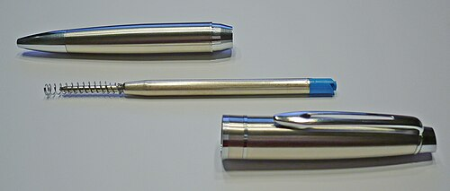 <b>el bolígrafo</b> <i>boh‑LEE‑grah‑foh</i> pen</td>
<td align="center">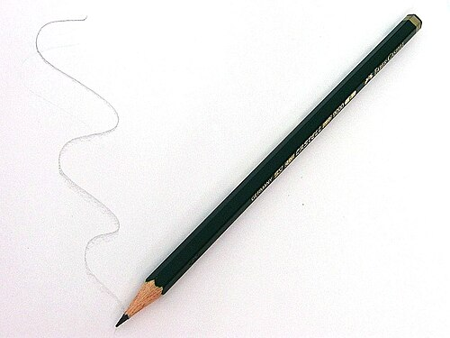 <b>el lápiz</b> <i>LAH‑peeth</i> pencil</td>
</tr>
<tr>
<td align="center">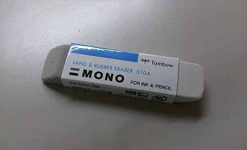 <b>la goma</b> <i>GOH‑mah</i> rubber / eraser</td>
<td align="center">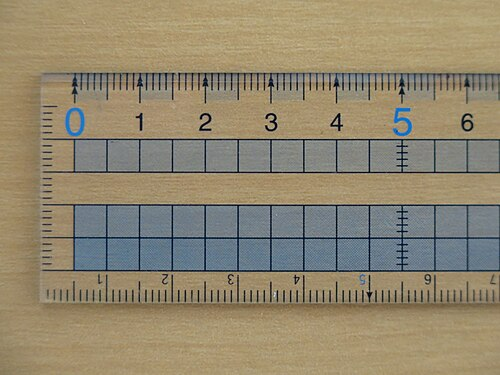 <b>la regla</b> <i>REH‑glah</i> ruler</td>
<td align="center">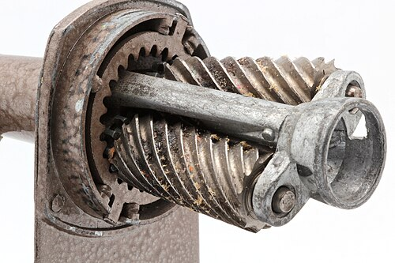 <b>el sacapuntas</b> <i>sah‑kah‑POON‑tas</i> pencil sharpener</td>
<td align="center">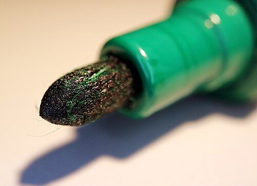 <b>el rotulador</b> <i>roh‑too‑lah‑DOR</i> felt‑tip / marker</td>
</tr>
<tr>
<td align="center">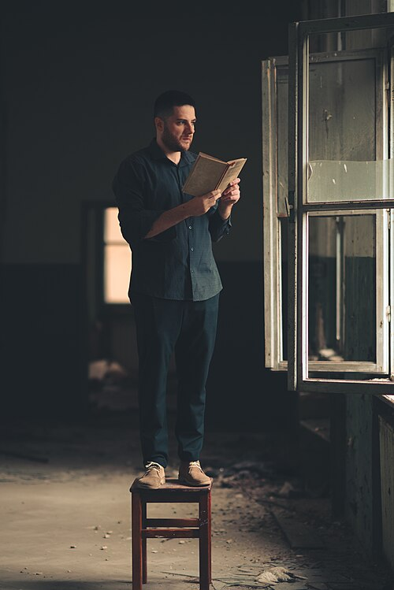 <b>el libro</b> <i>LEE‑broh</i> book</td>
<td align="center">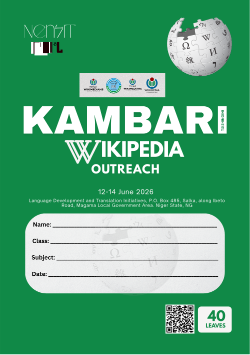 <b>el cuaderno</b> <i>kwah‑DER‑noh</i> exercise book</td>
<td align="center">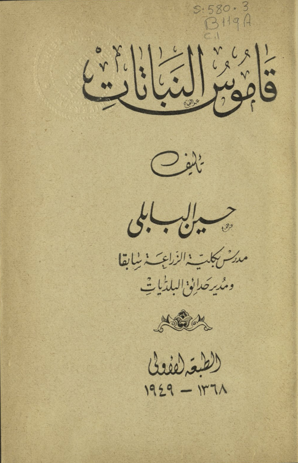 <b>el diccionario</b> <i>deek‑see‑oh‑NAH‑ree‑oh</i> dictionary</td>
<td align="center">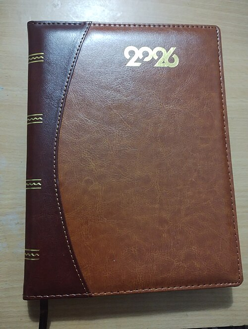 <b>la agenda</b> <i>ah‑HEN‑dah</i> planner / diary</td>
</tr>
<tr>
<td align="center">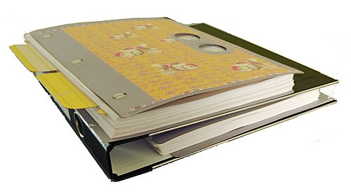 <b>la carpeta</b> <i>kar‑PEH‑tah</i> folder</td>
<td align="center"> <b>las tijeras</b> <i>tee‑HEH‑ras</i> scissors</td>
<td align="center">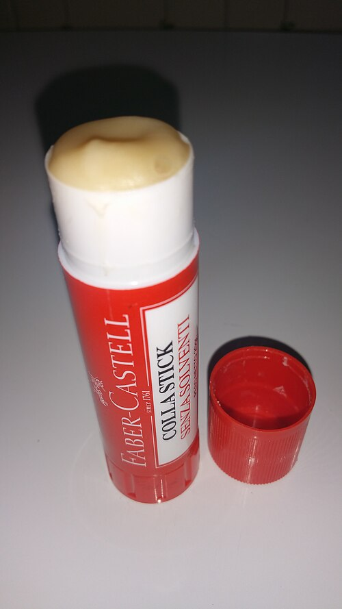 <b>el pegamento</b> <i>peh‑gah‑MEN‑toh</i> glue (stick)</td>
<td align="center">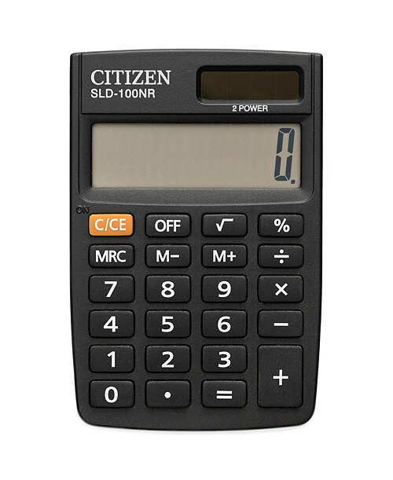 <b>la calculadora</b> <i>kal‑koo‑lah‑DOH‑rah</i> calculator</td>
</tr>
<tr>
<td align="center">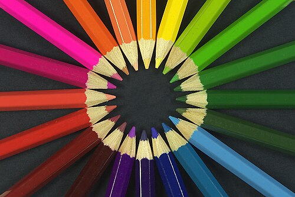 <b>los lápices de colores</b> <i>LAH‑pee‑thes</i> colouring pencils</td>
</tr>
</table>

---

## 1.5 Los colores — Colours

> 🔑 In Spanish the colour goes **after** the noun, and it must "agree": **un libro rojo** (a red book), **una goma roja** (a red rubber). Colours ending in **‑o** change to **‑a** for feminine; others stay the same.

<table>
<tr>
<td align="center">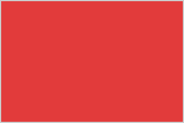 <b>rojo/a</b> — red</td>
<td align="center">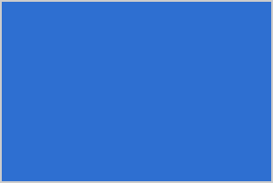 <b>azul</b> — blue</td>
<td align="center">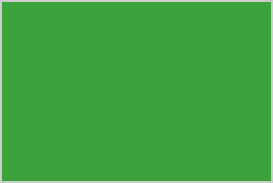 <b>verde</b> — green</td>
<td align="center">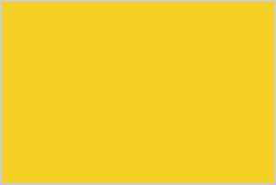 <b>amarillo/a</b> — yellow</td>
</tr>
<tr>
<td align="center">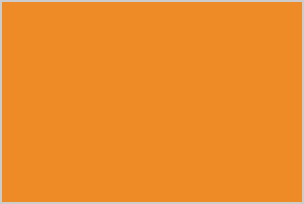 <b>naranja</b> — orange</td>
<td align="center">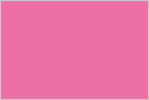 <b>rosa</b> — pink</td>
<td align="center">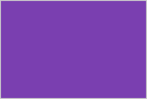 <b>morado/a</b> — purple</td>
<td align="center">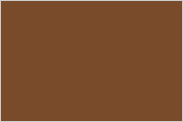 <b>marrón</b> — brown</td>
</tr>
<tr>
<td align="center">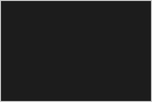 <b>negro/a</b> — black</td>
<td align="center">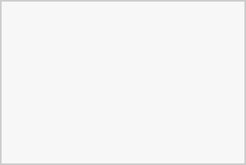 <b>blanco/a</b> — white</td>
<td align="center">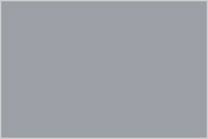 <b>gris</b> — grey</td>
</tr>
</table>

🧠 **Remember:** *verde* = think "**verd**ant" grass (green). *negro* = think "**Negro**" / night = black. *rojo* → think "**Rouge**".

---

## 1.6 Describir el material escolar — Describing your school things

> 🔑 **es** = it is (one thing) · **son** = they are (more than one). Add a reason with **porque** (because).
> The adjective agrees: **‑o** (boy‑word), **‑a** (girl‑word), **‑os/‑as** (plural).

| Spanish (m / f) | English |
|---|---|
| **chulo / chula** | cool |
| **nuevo / nueva** | new |
| **bonito / bonita** | nice / pretty |
| **útil** | useful |
| **viejo / vieja**, **antiguo / antigua** | old |
| **horroroso / horrorosa** | rubbish / horrible |
| **feo / fea** | ugly |

> Example: **Mi mochila es nueva y bonita.** = *My backpack is new and nice.*
> **Mis lápices son viejos pero útiles.** = *My pencils are old but useful.*

---

## 1.7 La familia — Family

> 🔑 **Tengo** (I have) + family member. **No tengo** (I don't have). **Soy hijo único / hija única** = I'm an only child.
> **mi** = my (one person), **mis** = my (more than one person). **En mi familia hay...** = In my family there is/are...

<table>
<tr>
<td align="center">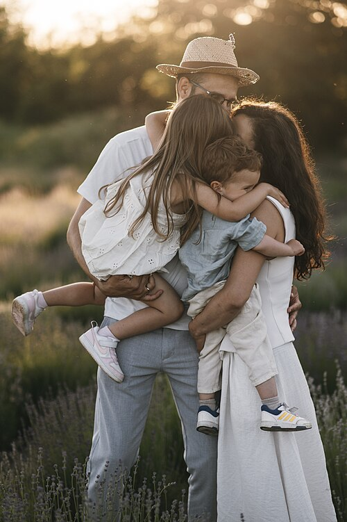 <b>la familia</b> family</td>
<td align="center">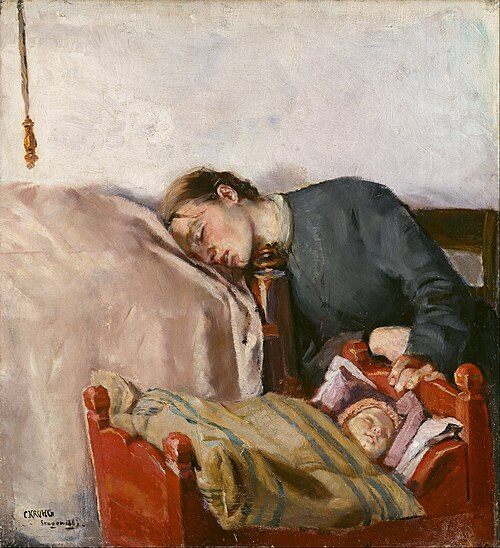 <b>la madre</b> mother</td>
<td align="center">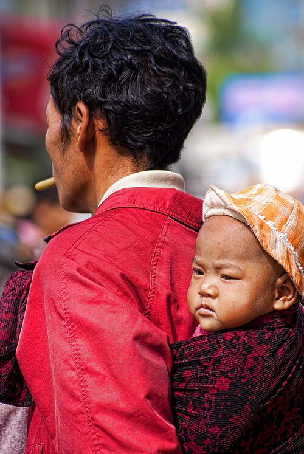 <b>el padre</b> father</td>
<td align="center">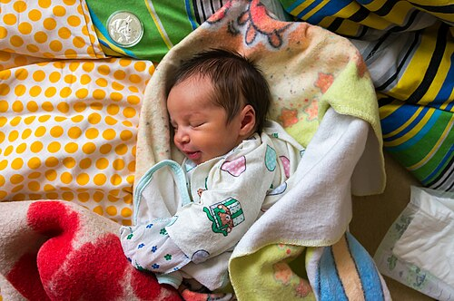 <b>el bebé</b> baby</td>
</tr>
<tr>
<td align="center">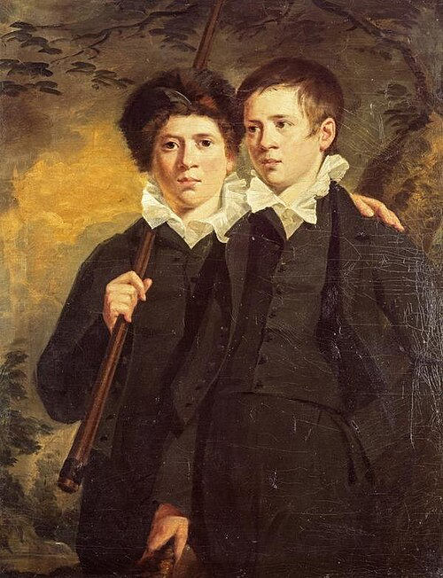 <b>el hermano</b> brother</td>
<td align="center">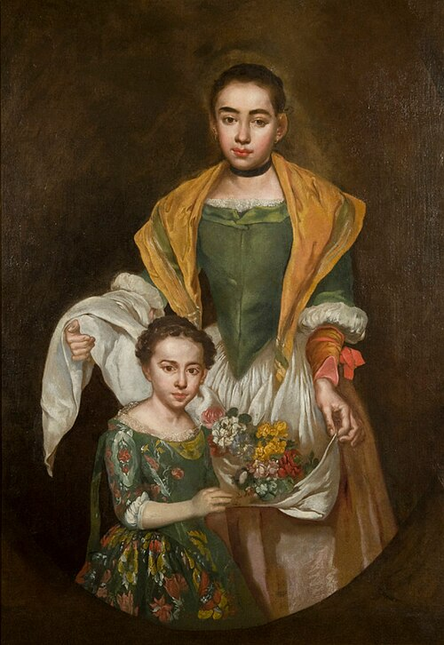 <b>la hermana</b> sister</td>
<td align="center">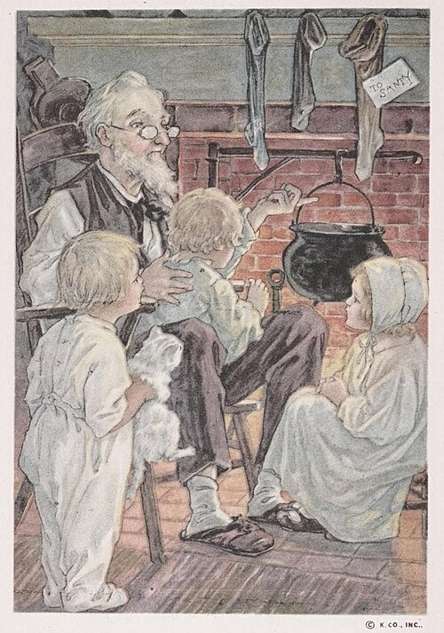 <b>el abuelo</b> grandfather</td>
<td align="center">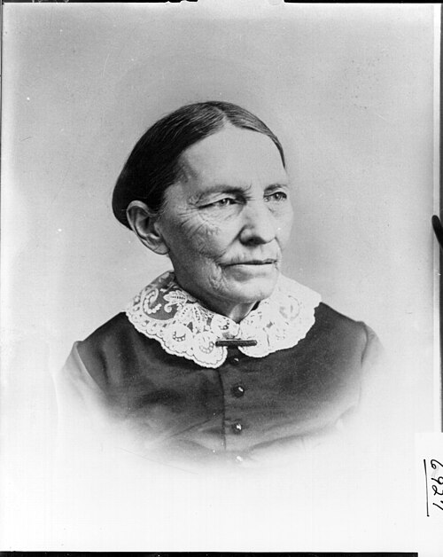 <b>la abuela</b> grandmother</td>
</tr>
</table>

| Spanish | English | Spanish | English |
|---|---|---|---|
| **mis padres** | parents | **mis abuelos** | grandparents |
| **el padrastro** | stepfather | **la madrastra** | stepmother |
| **el hermanastro** | stepbrother | **la hermanastra** | stepsister |
| **el tío / la tía** | uncle / aunt | **el primo / la prima** | cousin (m/f) |
| **el hermano mayor** | older brother | **el hermano menor** | younger brother |

---

## 1.8 La descripción física — What you look like

> 🔑 **Tengo el pelo...** (I have ... hair) and **Tengo los ojos...** (I have ... eyes). **Soy...** (I am ...) for height.

| Hair — **el pelo** | Eyes — **los ojos** | Height / extras |
|---|---|---|
| **rubio** = blond | **azules** = blue | **alto/a** = tall |
| **moreno / castaño** = brown / dark | **verdes** = green | **bajo/a** = short |
| **pelirrojo** = red‑haired | **marrones** = brown | **de estatura media** = medium height |
| **negro** = black | **grises** = grey | **Llevo gafas** = I wear glasses |
| **corto / largo** = short / long | | **Tengo barba** = I have a beard |
| **liso / rizado / ondulado** = straight / curly / wavy | | **Tengo pecas** = I have freckles |

> Example: **Tengo el pelo largo y rizado y los ojos verdes. Soy alta.**
> = *I have long curly hair and green eyes. I am tall.*

---

## 1.9 La personalidad — Personality

> 🔑 **Soy...** (I am ...) · **No soy...** (I am not ...). Endings change **‑o → ‑a** for girls; words ending in **‑e** or a consonant usually stay the same.

| Spanish (m/f) | English | Spanish (m/f) | English |
|---|---|---|---|
| **divertido/a** | fun | **trabajador/a** | hardworking |
| **gracioso/a** | funny | **perezoso/a** | lazy |
| **simpático/a** | nice / friendly | **antipático/a** | unfriendly |
| **hablador/a** | talkative | **tímido/a** | shy |
| **inteligente** | intelligent | **estudioso/a** | studious |
| **generoso/a** | generous | **serio/a** | serious |
| **deportista** | sporty | **ambicioso/a** | ambitious |

---

## 1.10 Las mascotas — Pets

> 🔑 **Tengo un/una...** (I have a...) · **No tengo...** (I don't have...). **Se llama...** = It's called... For more than one, add a number: **Tengo dos perros** (I have two dogs).

<table>
<tr>
<td align="center">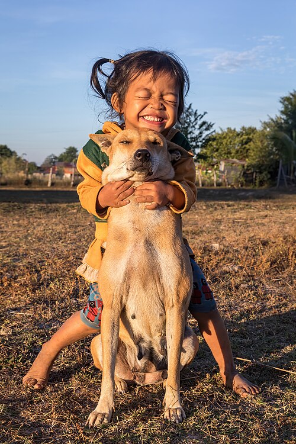 <b>un perro</b> — a dog</td>
<td align="center">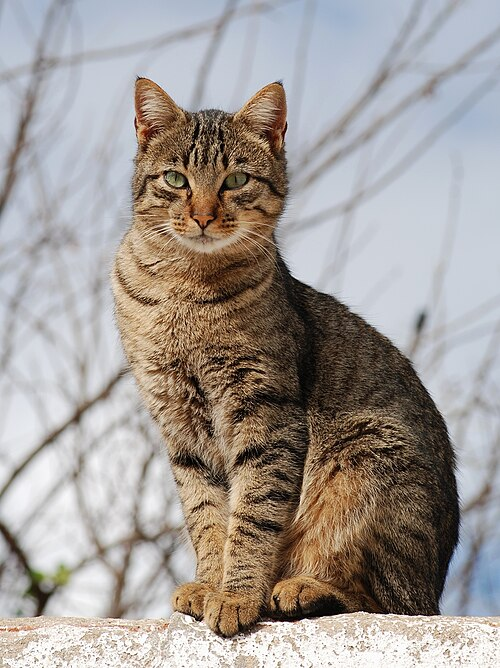 <b>un gato</b> — a cat</td>
<td align="center"> <b>un conejo</b> — a rabbit</td>
<td align="center">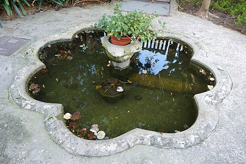 <b>un pez</b> — a fish</td>
</tr>
<tr>
<td align="center">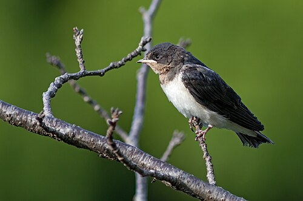 <b>un pájaro</b> — a bird</td>
<td align="center">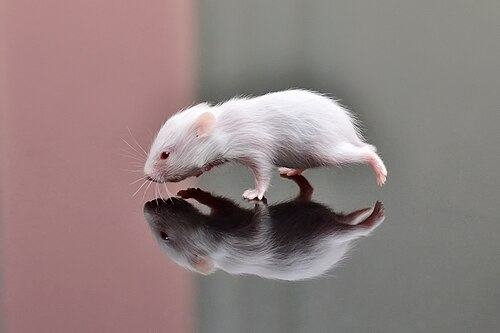 <b>un hámster</b> — a hamster</td>
<td align="center"> <b>una tortuga</b> — a tortoise</td>
<td align="center">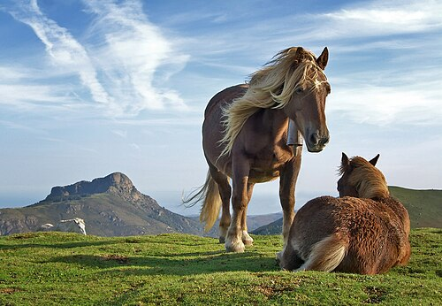 <b>un caballo</b> — a horse</td>
</tr>
<tr>
<td align="center">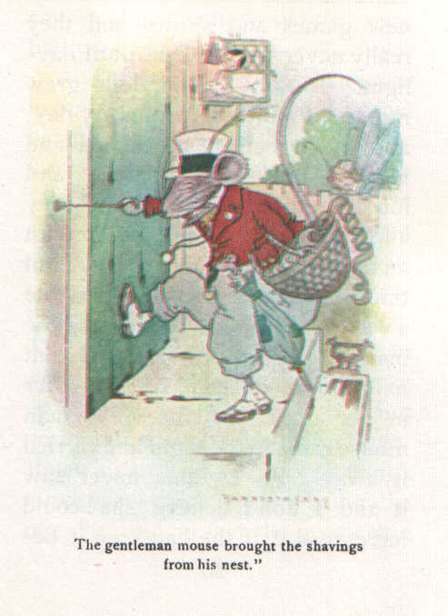 <b>un ratón</b> — a mouse</td>
<td align="center">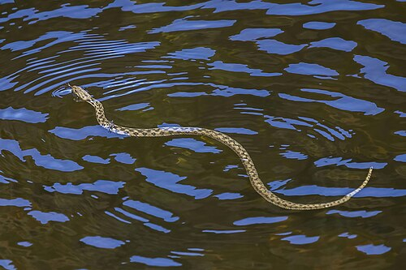 <b>una serpiente</b> — a snake</td>
<td align="center">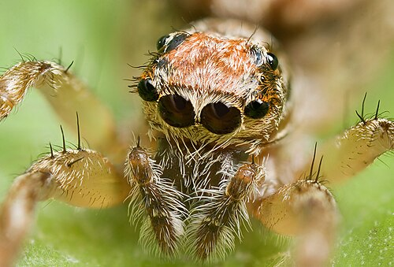 <b>una araña</b> — a spider</td>
<td align="center">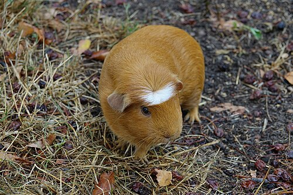 <b>una cobaya</b> — a guinea pig</td>
</tr>
</table>

> Example: **Tengo un perro negro. Se llama Max y es muy gracioso.**
> = *I have a black dog. He's called Max and he's very funny.*

---

### ✅ Quick self‑test (cover the right side!)
1. *I am tired* → **Estoy cansado/a**
2. *the 21st of March* → **el veintiuno de marzo**
3. *I have a red pencil case* → **Tengo un estuche rojo**
4. *My backpack is new* → **Mi mochila es nueva**
5. *I have two cats* → **Tengo dos gatos**

👉 When these feel easy, go to **[Term 1 → MCQ Mock 1](../question-bank/term-1/mcq-mock-1.md)**.
