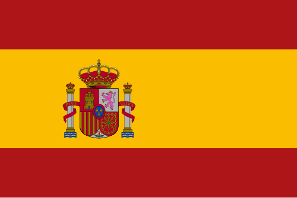
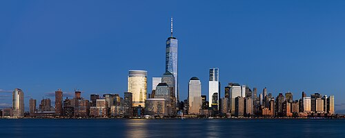
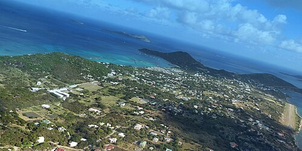

# 🇪🇸 Term 2 — Study Guide

**Topics:** where you're from • where you live • nationalities • languages you speak

> 💡 **Big idea for this term:** the verb **ser** (to be) is used for *where you're from* and *your nationality*
> (things that don't change), while **vivir** (to live) is used for *where you live*.

---

## 2.1 ¿De dónde eres? — Where are you from?

> 🔑 **Soy de...** = *I am from...* (+ a town or country). You can also say **Vengo de...** = *I come from...*

| Spanish | English |
|---|---|
| **¿De dónde eres?** | Where are you from? |
| **Soy de Inglaterra.** | I am from England. |
| **Soy de Madrid.** | I am from Madrid. |
| **Vengo de Escocia.** | I come from Scotland. |

### Countries — *los países*
| Spanish | English | Spanish | English |
|---|---|---|---|
| **Inglaterra** | England | **España** | Spain |
| **Escocia** | Scotland | **Francia** | France |
| **Gales** | Wales | **Alemania** | Germany |
| **Irlanda** | Ireland | **Italia** | Italy |
| **el Reino Unido** | the United Kingdom | **Estados Unidos** | United States |

 &nbsp; 

<i>la bandera de España (the flag of Spain) &nbsp;·&nbsp; la bandera del Reino Unido (the UK flag)</i>

---

## 2.2 ¿Dónde vives? — Where do you live?

> 🔑 **Vivo en...** = *I live in...* Use **en** (in) before the place.

<table>
<tr>
<td align="center"> <b>en una ciudad</b> in a city</td>
<td align="center"> <b>en un pueblo</b> in a town / village</td>
<td align="center"> <b>en el mapa</b> on the map</td>
</tr>
</table>

| Spanish | English |
|---|---|
| **Vivo en una ciudad.** | I live in a city. |
| **Vivo en un pueblo.** | I live in a town / village. |
| **Vivo en el campo.** | I live in the countryside. |
| **Vivo en la costa.** | I live on the coast. |
| **Vivo en las montañas.** | I live in the mountains. |
| **en el norte / sur / este / oeste de...** | in the north / south / east / west of... |

> Example: **Vivo en un pueblo pequeño en el norte de Inglaterra.**
> = *I live in a small town in the north of England.*

---

## 2.3 ¿Cuál es tu nacionalidad? — What is your nationality?

> 🔑 **Soy...** + nationality. Nationalities **change ending** for boys/girls and they are **not** capitalised.
> Boys often end in **‑o** or a consonant; girls usually end in **‑a**.

| Spanish (m / f) | English |
|---|---|
| **español / española** | Spanish |
| **inglés / inglesa** | English |
| **escocés / escocesa** | Scottish |
| **galés / galesa** | Welsh |
| **irlandés / irlandesa** | Irish |
| **británico / británica** | British |
| **francés / francesa** | French |
| **italiano / italiana** | Italian |
| **alemán / alemana** | German |
| **americano / americana** | American |

> Example (a girl speaking): **Soy británica pero mi madre es española.**
> = *I am British but my mum is Spanish.*

🧠 **Remember:** the boy form often has an **accent** (inglés, francés, alemán); the girl form drops the accent and adds **‑a** (inglesa, francesa, alemana).

---

## 2.4 ¿Qué idiomas hablas? — What languages do you speak?

> 🔑 **Hablo...** = *I speak...* · **No hablo...** = *I don't speak...* · **Quiero hablar...** = *I want to speak...*

| Language (Spanish) | English |
|---|---|
| **el español / el castellano** | Spanish |
| **el inglés** | English |
| **el francés** | French |
| **el alemán** | German |
| **el italiano** | Italian |
| **el chino** | Chinese |
| **el árabe** | Arabic |
| **el portugués** | Portuguese |

### How well? (add these after the language)
| Spanish | English |
|---|---|
| **un poco** | a little |
| **bastante bien** | quite well |
| **muy bien** | very well |
| **con fluidez** | fluently |

> Example: **Hablo inglés con fluidez y un poco de español.**
> = *I speak English fluently and a little Spanish.*

---

## 2.5 Putting it together

A full Term‑2 introduction sounds like this:

> **Me llamo Sofía. Soy de Manchester, en el norte de Inglaterra. Soy inglesa y vivo en una ciudad grande. Hablo inglés y francés, y quiero hablar español con fluidez.**
>
> *My name is Sofía. I'm from Manchester, in the north of England. I'm English and I live in a big city. I speak English and French, and I want to speak Spanish fluently.*

---

### ✅ Quick self‑test (cover the right side!)
1. *Where are you from?* → **¿De dónde eres?**
2. *I live on the coast* → **Vivo en la costa**
3. *I am Spanish* (girl) → **Soy española**
4. *I speak a little German* → **Hablo un poco de alemán**
5. *in the south of Spain* → **en el sur de España**

👉 When these feel easy, go to **[Term 2 → MCQ Mock 1](../question-bank/term-2/mcq-mock-1.md)**.
