# 🇪🇸 Term 3 — Study Guide

**Topics:** school subjects & opinions • teachers • what's in your school • the timetable • telling the time

> 💡 **Big idea for this term:** opinions! Learn **me gusta / no me gusta / me encanta / odio** and join them to a
> subject with a reason using **porque** (because).

---

## 3.1 Las asignaturas — School subjects

> 🔑 Subjects have **el / la / las** in front (the). Most are masculine (**el**), but the "‑ía" ones and a few others are feminine (**la**), and **las matemáticas / las ciencias** are plural.

<table>
<tr>
<td align="center">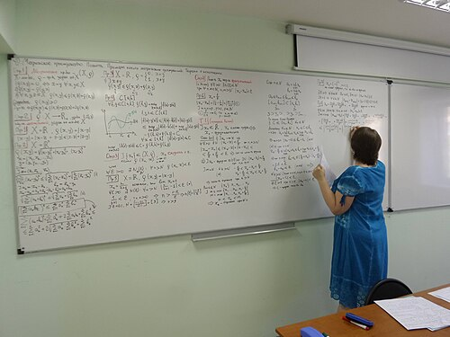 <b>las matemáticas</b> maths</td>
<td align="center">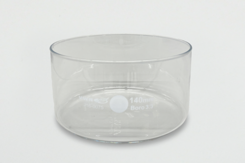 <b>las ciencias</b> science</td>
<td align="center">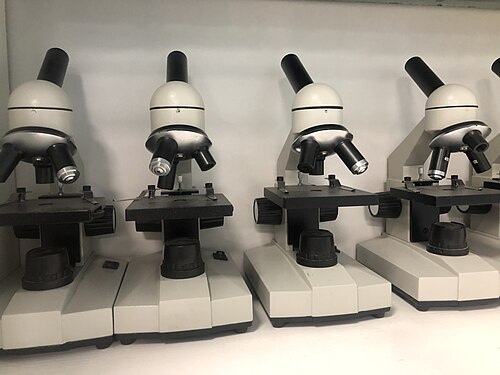 <b>la biología</b> biology</td>
<td align="center">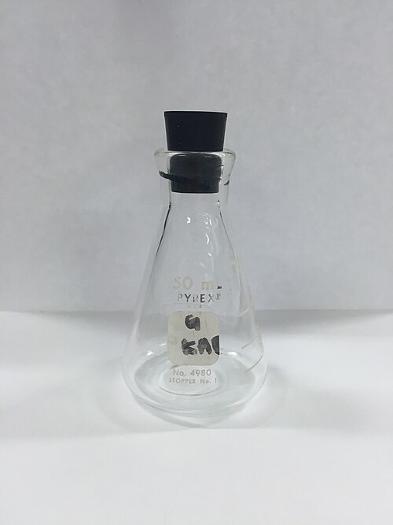 <b>la química</b> chemistry</td>
</tr>
<tr>
<td align="center">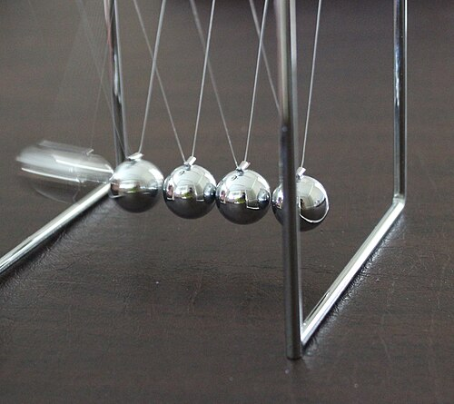 <b>la física</b> physics</td>
<td align="center">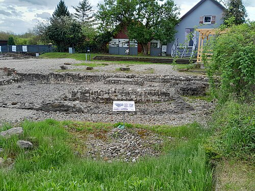 <b>la historia</b> history</td>
<td align="center"> <b>la geografía</b> geography</td>
<td align="center">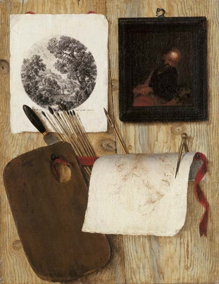 <b>el arte / el dibujo</b> art</td>
</tr>
<tr>
<td align="center"> <b>la música</b> music</td>
<td align="center"> <b>la educación física</b> P.E.</td>
<td align="center"> <b>el inglés</b> English</td>
<td align="center">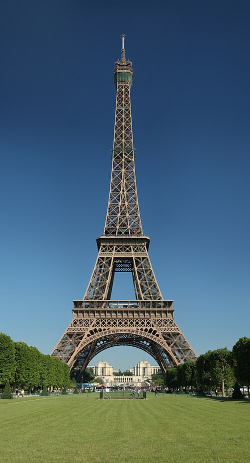 <b>el francés</b> French</td>
</tr>
<tr>
<td align="center"> <b>el español</b> Spanish</td>
<td align="center">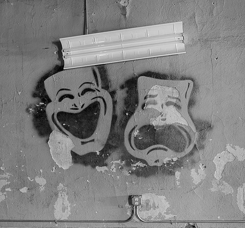 <b>el teatro / el drama</b> drama</td>
<td align="center">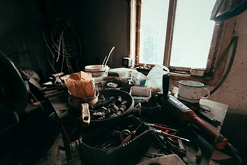 <b>la tecnología</b> technology / DT</td>
<td align="center">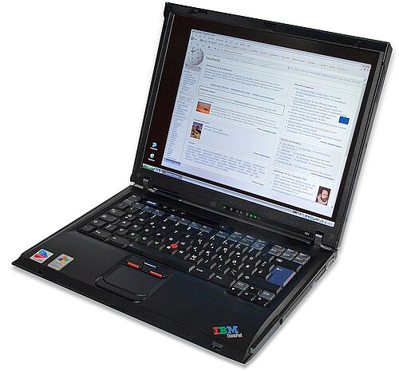 <b>la informática</b> ICT / computing</td>
</tr>
<tr>
<td align="center">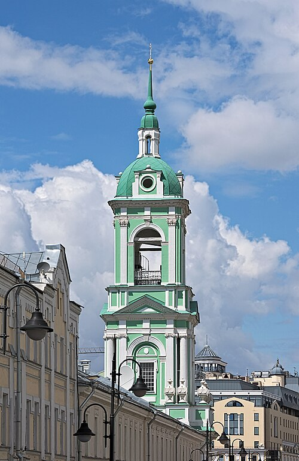 <b>la religión</b> R.E.</td>
</tr>
</table>

---

## 3.2 Opiniones — Saying what you think

> 🔑 **Opinion + subject + porque + es + adjective.**
> ⚠️ Tricky bit: with **me gusta / me encanta**, use **gusta** for one subject and **gustan** for plural subjects:
> **Me gusta la historia** (1 subject) but **Me gustan las ciencias** (plural subject).

| Opinion (Spanish) | English |
|---|---|
| **Me gusta(n)...** | I like... |
| **No me gusta(n)...** | I don't like... |
| **Me encanta(n)...** | I love... |
| **Odio...** | I hate... |
| **Prefiero...** | I prefer... |
| **Mi asignatura favorita es...** | My favourite subject is... |

### Reasons — *porque es...* (because it's...)
| Spanish | English | Spanish | English |
|---|---|---|---|
| **interesante** | interesting | **aburrido/a** | boring |
| **fácil** | easy | **difícil** | difficult |
| **útil** | useful | **inútil** | useless |
| **divertido/a** | fun | **guay** | cool |
| **importante** | important | **práctico/a** | practical |

> Example: **Me encanta el arte porque es divertido y relajante, pero odio las matemáticas porque son difíciles.**
> = *I love art because it's fun and relaxing, but I hate maths because it's difficult.*

---

## 3.3 Mis profesores — My teachers

> 🔑 **Mi profesor de... es...** (My male teacher of... is...) / **Mi profesora de... es...** (My female teacher of... is...). **Se llama...** = is called...

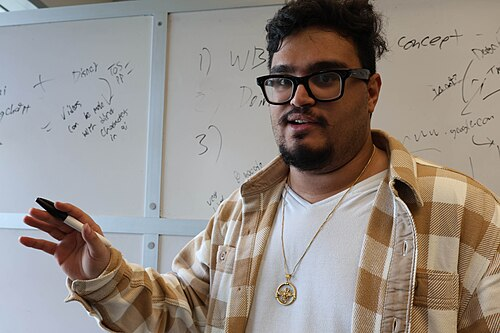 <i>el profesor / la profesora — the teacher</i>

| Spanish (m / f) | English | Spanish (m / f) | English |
|---|---|---|---|
| **simpático/a** | nice | **antipático/a** | unpleasant |
| **paciente** | patient | **estricto/a** | strict |
| **divertido/a** | fun | **aburrido/a** | boring |
| **justo/a** | fair | **severo/a** | severe / harsh |
| **inteligente** | intelligent | **trabajador/a** | hardworking |

> Example: **Mi profesora de inglés se llama señora Smith y es muy simpática y paciente.**
> = *My English teacher is called Mrs Smith and she is very nice and patient.*

---

## 3.4 ¿Qué hay en tu instituto? — What's in your school?

> 🔑 **En mi instituto hay...** = *In my school there is/are...* · **No hay...** = *There isn't/aren't...*

<table>
<tr>
<td align="center">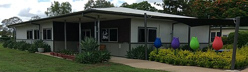 <b>el instituto</b> school</td>
<td align="center">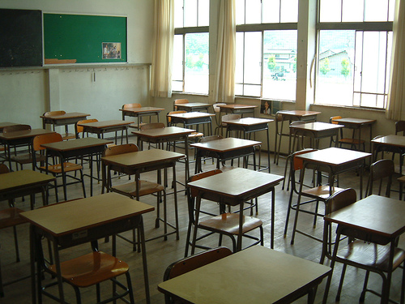 <b>las aulas / las clases</b> classrooms</td>
<td align="center">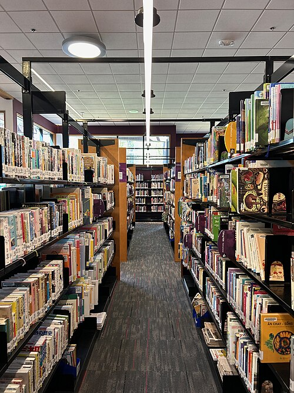 <b>la biblioteca</b> library</td>
<td align="center"> <b>el comedor</b> canteen</td>
</tr>
<tr>
<td align="center">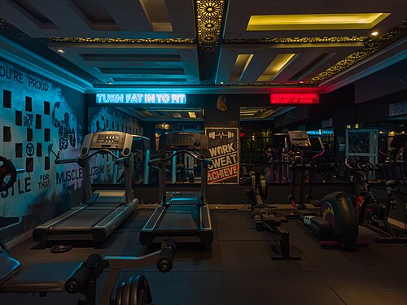 <b>el gimnasio</b> gym</td>
<td align="center">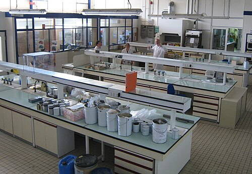 <b>el laboratorio</b> laboratory</td>
<td align="center">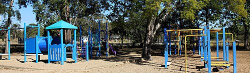 <b>el patio</b> playground</td>
</tr>
</table>

| Spanish | English |
|---|---|
| **un campo de fútbol** | a football pitch |
| **una sala de profesores** | a staff room |
| **un salón de actos** | an assembly hall |
| **muchas aulas** | lots of classrooms |

> Example: **En mi instituto hay una biblioteca grande y un gimnasio, pero no hay piscina.**
> = *In my school there is a big library and a gym, but there isn't a swimming pool.*

---

## 3.5 La hora — Telling the time

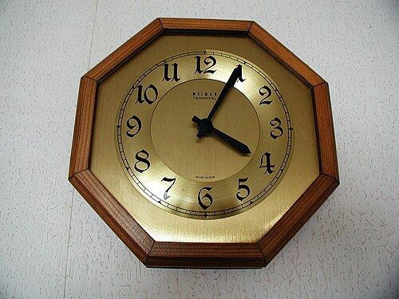 <i>el reloj — the clock · ¿Qué hora es? — What time is it?</i>

> 🔑 **Es la una** = It's 1 o'clock (only 1 o'clock uses **es la**). For all other hours use **Son las...**

| Spanish | English |
|---|---|
| **¿Qué hora es?** | What time is it? |
| **Es la una.** | It's one o'clock. |
| **Son las dos.** | It's two o'clock. |
| **Son las tres y cuarto.** | It's quarter past three. |
| **Son las cuatro y media.** | It's half past four. |
| **Son las cinco menos cuarto.** | It's quarter to five. |
| **Son las seis y diez.** | It's ten past six. |
| **Son las siete en punto.** | It's exactly seven o'clock. |
| **a las ocho** | at eight o'clock |

🧠 **Remember:** **y** = "past" (and), **menos** = "to" (minus). *y media* = half past · *y cuarto* = quarter past · *menos cuarto* = quarter to.

---

## 3.6 Mi horario — My timetable

> 🔑 **Los lunes tengo...** = *On Mondays I have...* · **a primera hora** = *first lesson* · **a las nueve** = *at nine o'clock*.

| Spanish | English |
|---|---|
| **¿Qué estudias?** | What do you study? |
| **¿Cuál es tu asignatura favorita?** | What is your favourite subject? |
| **¿Cuál es tu día favorito?** | What is your favourite day? |
| **¿A qué hora tienes...?** | At what time do you have...? |
| **Los lunes tengo historia a primera hora.** | On Mondays I have history first lesson. |
| **el recreo** | break time |
| **la hora de comer** | lunchtime |

> Example: **Mi día favorito es el viernes porque tengo arte y educación física. Los lunes tengo matemáticas a las nueve y es aburrido.**
> = *My favourite day is Friday because I have art and PE. On Mondays I have maths at 9 o'clock and it's boring.*

---

### ✅ Quick self‑test (cover the right side!)
1. *I love science because it's interesting* → **Me encantan las ciencias porque son interesantes**
2. *My favourite subject is art* → **Mi asignatura favorita es el arte**
3. *It's half past two* → **Son las dos y media**
4. *In my school there is a library* → **En mi instituto hay una biblioteca**
5. *My maths teacher is strict* → **Mi profesor/a de matemáticas es estricto/a**

👉 When these feel easy, go to **[Term 3 → MCQ Mock 1](../question-bank/term-3/mcq-mock-1.md)**.
